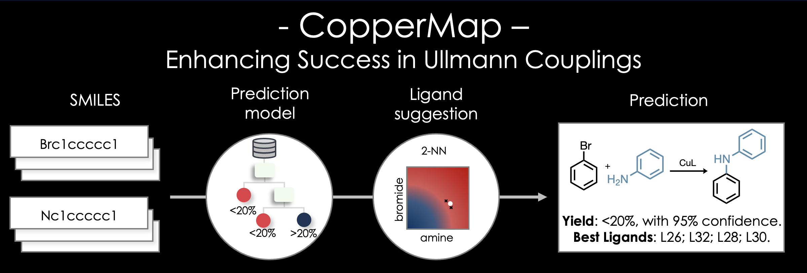

**CopperMap:** *Enhancing Success in Ullmann Couplings*

CopperMap is a Jupyter notebook developed with the goal of enhacing success in Cu-catalyzed C–N couplings (Ullmann couplings). The machine learning algorithm behind CopperMap was trained and validated using approximately 1000 experimental data points and was found to predict the yield outcome of Ullmann couplings (below or above 20% yield) between primary amines and aryl-bromides with an average accuracy of 87%. CopperMap also includes a ligand suggestion tool capable of finding the most probable working ligands for a given pair of coupling partners based on experimental results for similar compounds. 

## Manuscript Reference

CopperMap is derived from our manuscript posted on [Science Advances](https://www.science.org/doi/10.1126/sciadv.adn3478). For a more in-depth understanding of the model, its training, and validation, please refer to the manuscript.

## GitHub Repository Reference:

The complete dataset and notebook utilized for training the model can be accessed from the dedicated [GitHub repository](https://github.com/ljkaras/ullmann_project) for the Ullmann Coupling project.

## Domain of Applicability:

The training of CopperMap relied on a consistent set of reaction conditions:

- **Temperature:** 110°C
- **Solvent:** DMA
- **Base:** K₃PO₄
- **Cu Source:** CuI
- **Concentrations [0.25 M]:**
  - Aryl-bromide [1 eq]
  - Primary amine [1.2 eq]
  - CuI [10 mol%]
  - Ligand [20 mol%]
  - Base [2 eq]

We observed a degree of transferability of these conditions in our study, but the yield-predictions should be taken carefully for reactions in different conditions. For more details, refer to the [manuscript](https://www.science.org/doi/10.1126/sciadv.adn3478).

## Features

- **Prediction Tool:** Find out the likelihood of success for a given pair of substrates.
- **Ligand Suggestion Tool:** Receive information about the ligands most likely to work for the specific coupling partners.

## Getting-Started

Ensure you have [conda](https://docs.conda.io/en/latest/miniconda.html) installed before proceeding.

1. Clone this repository.
```shell
git clone https://github.com/ljkaras/CopperMap.git
```
2. Create and activate the Python environment.
```shell 
conda env create -f environments/coppermap_mac.yml  # for MacBook
```
```shell 
conda env create -f environments/coppermap_windows.yml  # for Windows
```
```shell 
conda activate coppermap
```
3. Install IPykernel and create a Jupyter kernel for the Python environment.
```shell 
conda install ipykernel
```
```shell 
python -m ipykernel install --user --name=coppermap --display-name "coppermap"
```
4. Open the notebook: `CopperMap.ipynb`.
5. Follow the instructions within the notebook for predictions and ligand suggestions.

### Alternative to .yml Environments

If you encounter issues with .yml files, you can manually install the required libraries for CopperMap. Ensure you have [conda](https://docs.conda.io/en/latest/miniconda.html) installed before proceeding.

1. **Pandas:**
   ```bash
   conda install pandas
   ```
2. **Matplotlib:**
   ```bash
   conda install matplotlib
   ```
3. **RDKit:**
   ```bash
   conda install -c conda-forge rdkit
   ```
4. **Scikit-learn (v.1.2.2):**
   ```bash
   conda install scikit-learn=1.2.2
   ```
Remember to activate your environment before launching CopperMap.

## Citation

If you find CopperMap useful, please cite our manuscript:

> M. Samha,# L. Karas,# D. Vogt, E. Odogwu, J. Elward, J. Crawford, J. Steves, M. Sigman. Predicting Success in Cu-Catalyzed C–N Coupling Reactions using Data Science. Science Advances, 2024, 10, eadn3478. DOI: 10.1126/sciadv.adn3478.

## Credits

Developed by [The Sigman Lab](https://www.sigmanlab.com)  
Tool Developer: Lucas Karas; Library Developer: David Vogt; Experimental Results: Moe Samha
